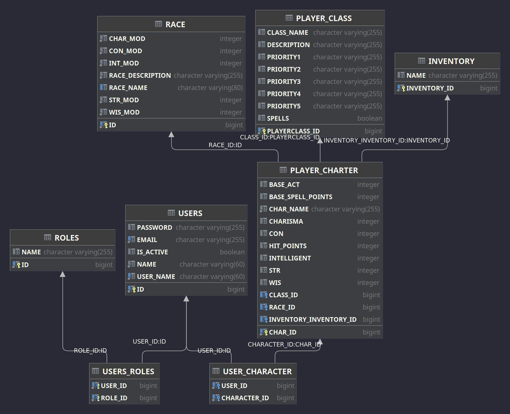

# explorer

A RPG API

# Project Summary :

# User Stories :
* ### User :
  1. As a User I want to be able to create an account.
  2. As a user I want to be able to create multiple avatars. 
  3. As a user I want to be able to pick a class and race for my avatars.

* ### Admin :
  1. As an admin I want to be able to create new races.
  2. As an admin I want to be able to create new player classes.
  3. As an admin I want to be able to Create new Items.

* ### Moderator :
  1. As a Moderator I want to be able to see a list of users.
  2. As a Moderator I want to be able to suspend a User.

## ERD User/character:

## Dependencies :

## Challenges Faced :

## EndPoints :

| http:// Method| Endpoint| Description| Public/User/Admin
|--|--|--|--|
||**User login and registration**
|Get | api/auth/login | Login in to Account | Public
|Get | api/auth/register | Register a new Account | Public
||**Admin Race Controller**
|GET | api/v1/admin/getall | Get All races | Admin

## Technologies Leveraged :

| Tech. Name             | Utilization in Project                   |
|------------------------|------------------------------------------|
| Spring Security crypto | Hashing function stores passwords in DB. |
| Java 19                | Code language.                           |
| Maven                  | Java dependency management.              |
| H2                     | SQL DataBase.                            |
| Spring Boot            | API framework.                           |
| Spring Security 6.0    | Security authentication                  |
| JWT                    | JSON signed with HS256 algorithm.        |
| JUnit                  | Unit testing                             |
| Mockito                | Mocking agent                            |

